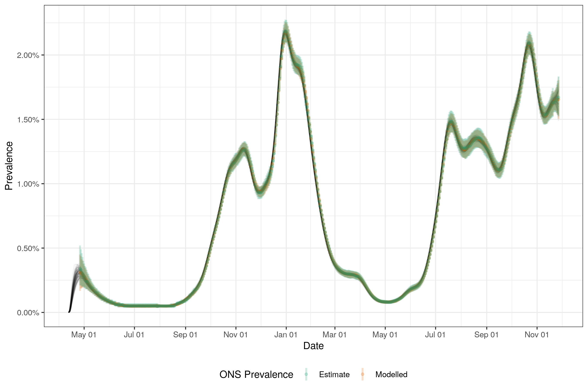
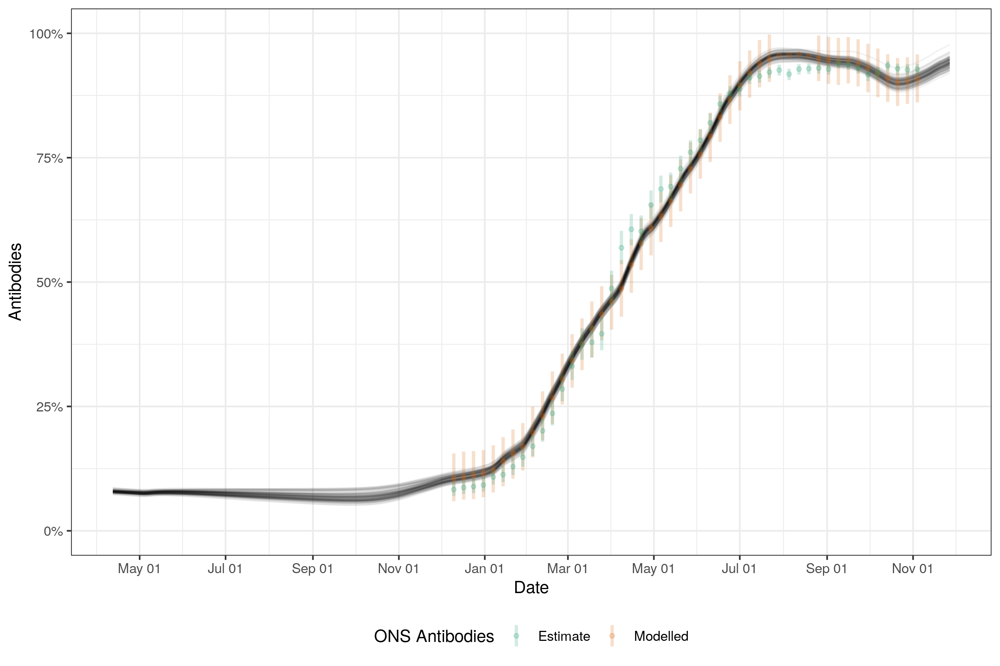

# Estimating epidemiological quantities from prevalence and antibody estimates in the ONS Community Infection Survey

We use a semi-mechanistic method to estimating incidence from Office for National Statistics (ONS) prevalence and antibody positivity estimates at the national, and subnational levels, as well as across age groups.

# Citation

# Summary

## Method

Our approach assumes that unobserved infections can be represented using an initial intercept and a Gaussian process with a logit link function. We use a Matern 3/2 kernal and an approximate Hilbert space Gaussian process formulation to reduce the computational cost. To estimate population prevalence we convolve the PCR detection curve estimated in Hellewell _et al._, _BMC Medicine_, 2021, with uncertainty assumed to be normal and independent for each day since infection, with our estimated infection curve. To map this to estimated prevalence from the ONS we assume a normal observation model with the standard error made up of the ONS estimated standard error and a shared standard error term estimated in the model. 

We model antibody postitivity by fitting an initial proportion of the population that have infection derived antibodies. We then fit a daily model that assumes that some fraction of new infections that are not already antibody postive (here we assume equivalent infection risk for individuals who are antibody positive and negative) become so and that a proportion of those current antibody postive become antibody negative. We include vaccination similarly and assume that some fraction of those vaccination become antibody positive and that this positivity wanes with a daily rate (independent from the waning rate of those antibody positive from infection). This estimate of population level antibody positivity is then averaged across the time windows of the available antibody positivity estimates with again a normal observation model being assumed with the standard error made up of the ONS estimated standard error and a shared standard error term estimated in the model. 

This model can be described mathematically as follows:


## Implementation

The model is implemented in `stan` using `cmdstanr` with the maximum treedepth increased to 12 from the default of 10. 

## Limitations

 - Assumes that the probability of detection follows the Hellewell et al estimates and that testing of survey participants is happening each day, which is unlikely, but for which there is little public information.

 - Assumes that uncertainty in the Hellewell et al estimates is independent normal which is known not to be the case. This limitation is imposed by not implementing the parameteric Hellewell et al model though this could in principle be done. However, this would again assume some level of independence in parameters and so still not return the posterior distribution found by Hellewell at al.

- Assumes that infections can be well modelled by a Gaussian process with a Matern 3/2 kernal. This may not be the case for a range of reasons such as variation over time is non-stationary, and variation is piecewise constant.

- Real-time estimates may be unreliable as a zero mean Guassian process has been used. Alternative approaches exist to account for this but each of these imposes a parameteric assumption. Further work is needed on this area.

- Assumes that antibody waning, from both infection and vaccination, wanes with an exponential rate. 

# Estimates from England

We ONS estimates for prevalence and antibody positivity in England to estimate infections and transmission parameters. The code to reproduce these results can be found [here](https://github.com/epiforecasts/inc2prev/blob/master/scripts/simple-example.R)



*Figure 1: ONS prevalence estimates compared to model estimates of ONS prevalence combined with model estimates of population prevalence.*



*Figure 1: ONS antibody positivity estimates compared to model estimates of ONS antibody positivity combined with model estimates of population antibody positivity.*


*Figure 2: Model infection estimates*


*Figure 3: Model infection growth rate estimates*


*Figure 4: Model effective reproduction rate rate estimates*

## Fit diagnostics


*Figure 5: Pairs plot of a sample of parameter posteriors*

# Documentation

## File structure

Folder | Purpose
---|---
[`data-raw`](data-raw/) | Raw data and scripts to generate processed data.
[`data`](data/) | Data processed ready for use in downstream analyses.
[`R`](R/) | R functions for preprocessing data, model fitting, and model postprocessing.
[`scripts`](scripts/) | Scripts used to estimate models and analyse result.
[`stan`](stan/) | The backend stan model code and support functions.
[`.devcontainer`](.devcontainer/) | Contains the projects `Dockerfile` and setup instructions for using the code with `vscode`.

## Dependencies

All dependencies can be installed using the following, 

```{r}
remotes::install_dev_deps()
```

Alternatively a docker [container](https://github.com/epiforecasts/inc2prev/blob/main/.devcontainer/Dockerfile) and [image](https://github.com/epiforecasts/inc2prev/pkgs/container/eval-germany-sp-nowcasting) is provided. An easy way to make use of this is using the Remote development extension of `vscode`.

## Installing CmdStan

If you don’t already have CmdStan installed then it is also necessary to install CmdStan usin CmdStanR’s `install_cmdstan()` function to enable model fitting. A suitable C++ toolchain is also required. Instructions are provided in the [*Getting started with CmdStanR*](https://mc-stan.org/cmdstanr/articles/cmdstanr.html) vignette. See the [CmdStanR documentation](https://mc-stan.org/cmdstanr/) for further details and support.

``` r
cmdstanr::install_cmdstan()
```

# License

This project uses data from the Office for National Statistics Community Infection Survey, which is licensed under the [Open Government License v3.0](https://www.ons.gov.uk/peoplepopulationandcommunity/healthandsocialcare/conditionsanddiseases/datasets/coronaviruscovid19infectionsurveydata).


