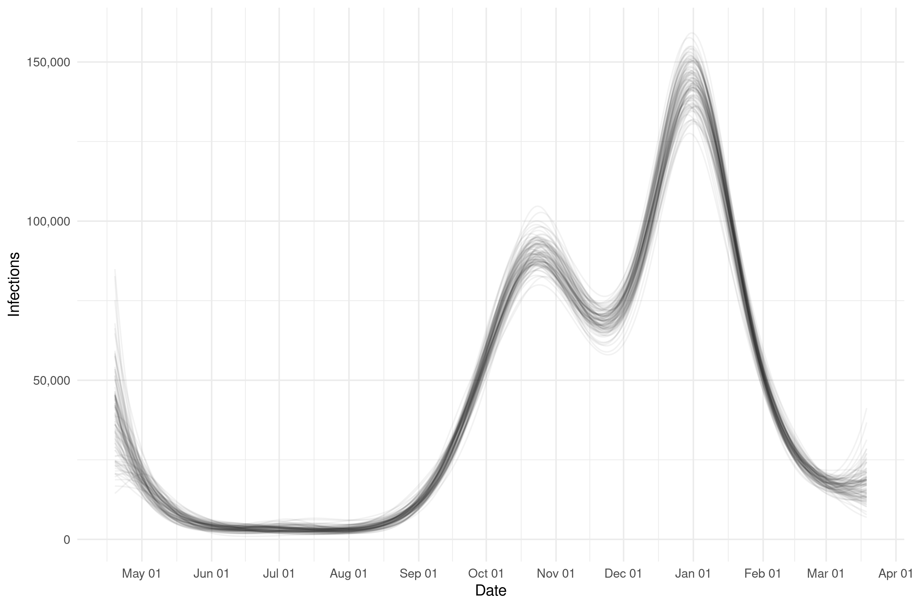
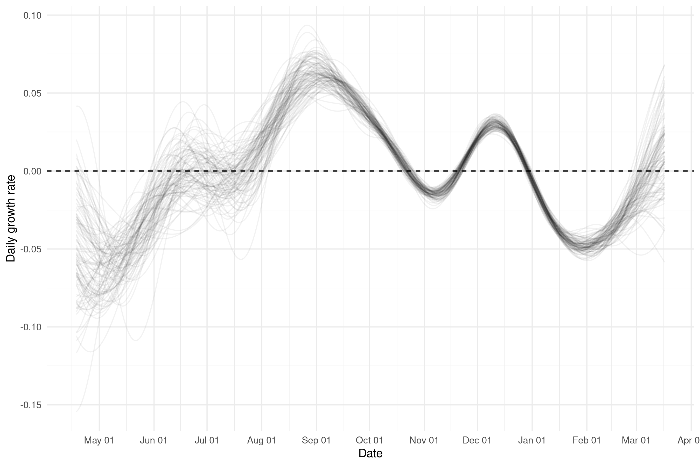
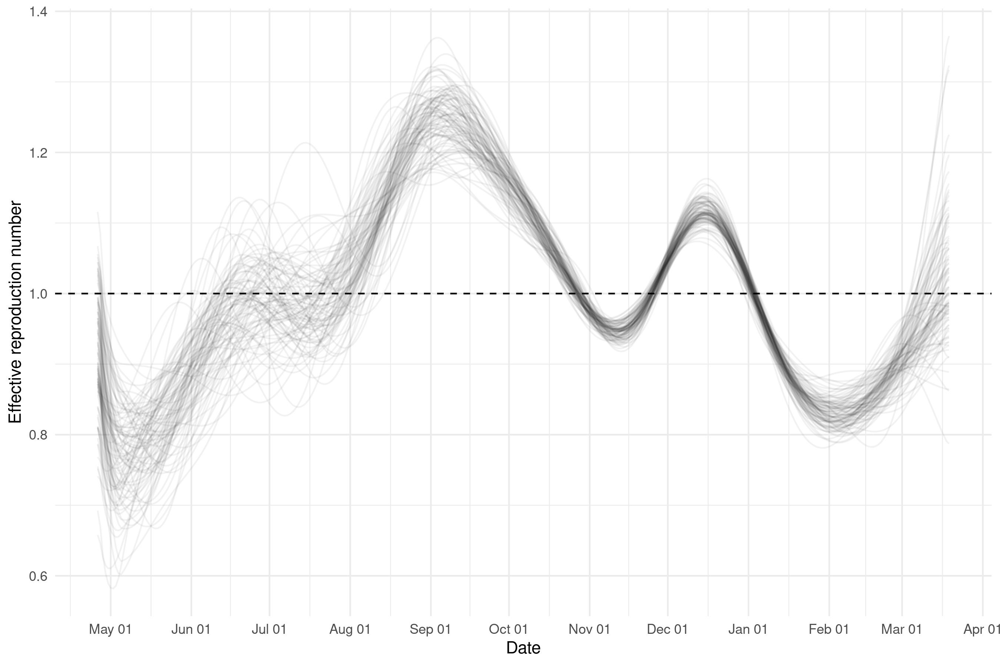
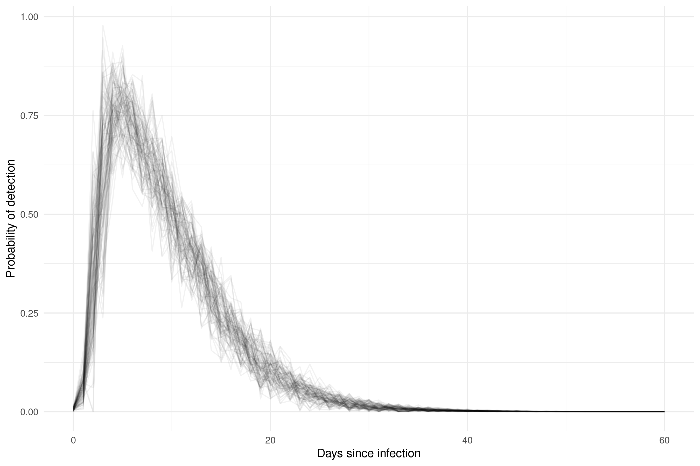

# Estimate incidence from prevalence estimates

This repository contains a deconvolution method (`stan/model.stan`) for estimating infections from Office for National Statistics (ONS) prevalence estimates. It shares code with an under development Rt estimation tool (`ctdist`) that uses Ct values (a reimplementation of the Hay et al method) and itself was based on the work done in `EpiNow2`.

## An overview of the approach

1. Infections are simulated by scaling the background population by an initial incidence rate and a gaussian process scaled using an inverse logit transformation.

2. The probability of detecting infections is assumed to follow the distribution estimated by Hellewell et al. with uncertainty assumed to be indepedent in time and normally distributed.

3. The probability of detection is convolved to estimated infections to get the number of cases detectable at any individual time point.

4. In order to be comparable with ONS data detectable cases are averaged in the time window to which each ONS estimate applies (two weeks currently) and then divided by the population to give a prevalence estimate in that window. 

5. The observation model for each estimate is assumed to be normally distributed with the standard error made up of the ONS estimated standard error and a shared standard error term estimated in the model. 

## Limitations

1. Assumes that the probability of detection follows the Hellewell et al estimates and that testing of survey participants is happening each day, which is unlikely, but for which there is little public information.

2. Assumes that uncertainty in the Hellewell et al estimates in independent normal which is known not to be the case. This limitation is imposed by not implementing the parameteric Hellewell et al model though this could in principle be done. However, this would again assume some level of independence in parameters and so still not return the posterior distribution found by Hellewell at al. 

3. Assumes that infections can be well modelled by a Gaussian process with a Matern 3/2 kernal. This may not be the case for a range of reasons such as variation over time is non-stationary, and variation is piecewise constant.

4. Real-time estimates may be unreliable as a zero mean Guassian process has been used. Alternative approaches exist to account for this but each of these imposes a parameteric assumption. Further work is needed on this area.

## Future work

1. Mitigate some or all of the limitations described above.

2. Use confidential data from ONS or other sources that contains more information on the sampling process and hence helps mitigate bias and reduce uncertainty.

3. Introduce fitting to count data with a flexible scale parameter (i.e the ascertainment rate for cases).

## Preliminary results

Preliminary results use ONS estimates for prevalence in England to estimte infections and transmission parameters.

*Figure 1: ONS prevalence estimates compared to model estimates of ONS prevalence combined with model estimates of population prevalence.*

*Figure 2: Model infection estimates*

*Figure 3: Model infection growth rate estimates*

*Figure 4: Model effective reproduction rate rate estimates*

## Fit diagnostics

*Figure 4: Model estimates of the probability of detection overlaid with estimates from Hellewell et al.*

*Figure 5: Pairs plot of a sample of parameters posteriors*
