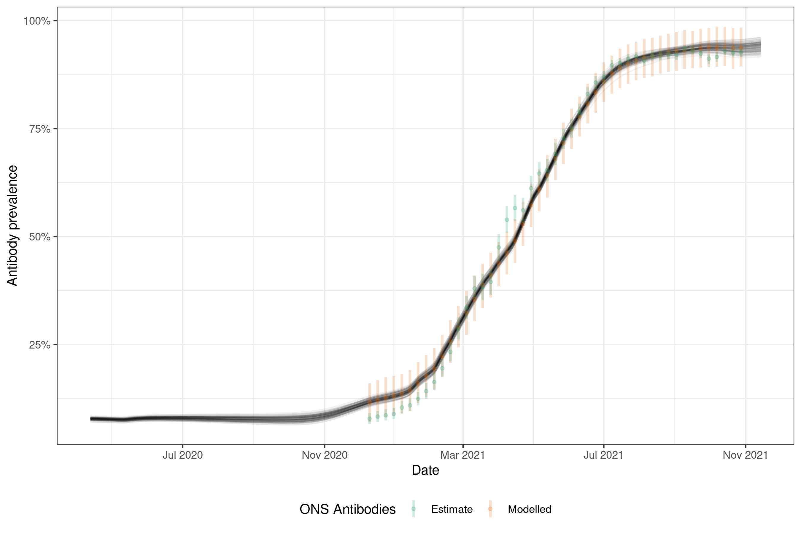

# Estimate epidemiological quantities from repeated cross-sectional prevalence measurements 

In this work, we use a semi-mechanistic method to estimating epidemiological quantities such as infection incidence, infection growth rates, reproduction numbers and immunological parameters from Office for National Statistics (ONS) prevalence and antibody positivity estimates at the national, and subnational levels, as well as across age groups.
Our approach assumes that unobserved infections can be represented using an initial intercept and a Gaussian process with a logit link function.
To estimate population prevalence we convolve the PCR detection curve estimated in [Hellewell _et al._, _BMC Medicine_, 2021](https://doi.org/10.1186/s12916-021-01982-x), with uncertainty assumed to be normal and independent for each day since infection

We model antibody postitivity by fitting an initial proportion of the population that have infection derived antibodies.
We then fit a daily model that assumes that some fraction of new infections that are not already antibody postive become so and that a proportion of those current antibody postive become antibody negative. 
We include vaccination similarly and assume that some fraction of those vaccination become antibody positive and that this positivity wanes with a daily rate (independent from the waning rate of those antibody positive from infection). 
This estimate of population level antibody positivity is then averaged across the time windows of the available antibody positivity estimates with again a normal observation model being assumed with the standard error made up of the ONS estimated standard error and a shared standard error term estimated in the model. 

The model is implemented in `stan` using `cmdstanr`.

# Citation

Abbott, Sam, and Sebastian Funk. 2022. _Estimating Epidemiological Quantities from Repeated Cross-Sectional Prevalence Measurements._ medRxiv. https://doi.org/10.1101/2022.03.29.22273101.

**[Preprint](https://doi.org/10.1101/2022.03.29.22273101)**

**Working paper: [as html](https://epiforecasts.io/inc2prev/paper), [or pdf](https://github.com/epiforecasts/inc2prev/paper.pdf)**

# Real-time estimates

The latest estimates are available in a [real-time report](https://epiforecasts.io/inc2prev/report).

The code in this repository can be used to [reproduce the results](https://github.com/epiforecasts/inc2prev/blob/master/scripts/estimate.R),
and [create the figures](https://github.com/epiforecasts/inc2prev/blob/master/scripts/plot_estimates.R)
Estimates are also available as [data tables](https://github.com/epiforecasts/inc2prev/blob/master/outputs/) (labelled estimates_{level}.csv).

# Example estimates from England

We ONS estimates for prevalence and antibody positivity in England to estimate infections and transmission parameters. The code to reproduce these results can be found [here](https://github.com/epiforecasts/inc2prev/blob/master/scripts/simple-example.R)


*Figure 1: ONS prevalence estimates compared to model estimates of ONS prevalence combined with model estimates of population prevalence.*



*Figure 2: ONS antibody positivity estimates compared to model estimates of ONS antibody positivity combined with model estimates of population antibody positivity.*


*Figure 3: Daily infection incidence estimates*


*Figure 4: Infection growth rate estimates*


*Figure 5: Effective reproduction rate rate estimates*

## Fit diagnostics


*Figure 6: Pairs plot of a sample of parameter posteriors*

# Documentation

## File structure

Folder | Purpose
---|---
[`data-raw`](data-raw/) | Raw data and scripts to generate processed data.
[`data-processed`](data-processed/) | Data processed ready for use in downstream analyses.
[`R`](R/) | R functions for preprocessing data, model fitting, and model postprocessing.
[`scripts`](scripts/) | Scripts used to estimate models and analyse result.
[`stan`](stan/) | The backend stan model code and support functions.
[`.devcontainer`](.devcontainer/) | Contains the projects `Dockerfile` and setup instructions for using the code with `vscode`.

## Obtaining data

The data used in this repository can be obtained using the scripts in
`data-raw/`. In particular, PCR positivity data by nation, region, age and
variant can be downloaded using

```sh
Rscript data-raw/update-cis.R
```

and antibody data can be downloaded using

```sh
Rscript data-raw/update-ab.R
```

## Reproducing the estimates

Estimates provided here can be generated using the `scripts/estimate.R` script. Before running this, the `inc2prev` package contained in this repository needs to be installed, e.g. using

```r
remotes::install_github("epiforecasts/inc2prev")
```

The estimates shown in the plots above were generated using

```sh
Rscript scripts/estimate.R -d 1
```

## Dependencies

All dependencies can be installed using the following, 

```r
remotes::install_dev_deps()
```

Alternatively a docker [container](https://github.com/epiforecasts/inc2prev/blob/main/.devcontainer/Dockerfile) and [image](https://github.com/epiforecasts/inc2prev/pkgs/container/inc2prev) is provided. An easy way to make use of this is using the Remote development extension of `vscode`.

## Installing CmdStan

If you don’t already have CmdStan installed then it is also necessary to install CmdStan usin CmdStanR’s `install_cmdstan()` function to enable model fitting. A suitable C++ toolchain is also required. Instructions are provided in the [*Getting started with CmdStanR*](https://mc-stan.org/cmdstanr/articles/cmdstanr.html) vignette. See the [CmdStanR documentation](https://mc-stan.org/cmdstanr/) for further details and support.

```r
cmdstanr::install_cmdstan()
```

# License

This project uses data from the Office for National Statistics Community Infection Survey, which is licensed under the [Open Government License v3.0](https://www.ons.gov.uk/peoplepopulationandcommunity/healthandsocialcare/conditionsanddiseases/datasets/coronaviruscovid19infectionsurveydata).


